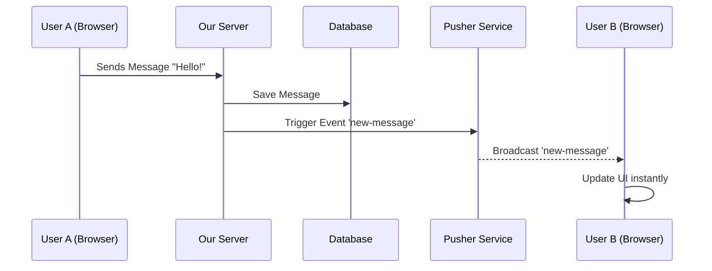

# Understanding Pusher in Our Application

## 1. What is Pusher?
Imagine you are in a group chat. When your friend sends a message, you want to see it *immediately* without refreshing the page.
**Pusher** is a service that makes this "real-time" magic happen. It acts like a postman who instantly delivers messages between the server (where the app lives) and the client (your browser).

**Simple Analogy:**
- **Without Pusher:** You have to keep checking your mailbox every few seconds to see if you have new mail (Polling).
- **With Pusher:** The postman rings your doorbell the moment a letter arrives (Real-time).

## 2. Why do we use it?
We use Pusher to make our application feel alive and responsive. specifically for:
- **Instant Messaging:** When someone sends a message in a group, everyone else sees it instantly.
- **Typing Indicators:** Showing "John is typing..." in real-time.
- **Live Updates:** Updating message status (edited/deleted) without reloading.

## 3. How it Works in Our App (The Flow)
1.  **User A sends a message.**
2.  Our **Server** saves it to the database.
3.  Our **Server** tells **Pusher**: "Hey, a new message just arrived for Group 123!"
4.  **Pusher** shouts to everyone currently looking at Group 123: "New message!"
5.  **User B's Browser** hears this and instantly shows the new message.



## 4. Code Walkthrough
Here is how we implemented this in our code.

### A. The Setup (Connecting the Pipes)
We have two main configuration files:

1.  **Server-Side (`lib/pusher/server.ts`)**:
    -   This is used by our backend to *send* events.
    -   It uses secret keys (`PUSHER_APP_ID`, `PUSHER_SECRET`) to prove to Pusher that we are allowed to send messages.

2.  **Client-Side (`lib/pusher/client.ts`)**:
    -   This is used by the user's browser to *listen* for events.
    -   It uses a public key (`NEXT_PUBLIC_PUSHER_KEY`) to connect.

### B. Sending a Message (The Trigger)
**File:** `app/api/groups/[groupId]/messages/route.ts`

When you send a message, this API route runs. Look at this part:

```typescript
// 1. Save to Database first
const [newMessage] = await db.insert(groupMessages).values({ ... });

// 2. Trigger Real-time Event
await triggerGroupMessage(groupId, PUSHER_EVENTS.NEW_MESSAGE, messageWithUser);
```

We save the message to our database first to ensure it's safe. Then, we call `triggerGroupMessage` which sends the data to Pusher.

### C. Receiving a Message (The Listener)
**File:** `hooks/use-group-messages.ts`

This is a React Hook that runs in the user's browser. It "subscribes" to the group's channel.

```typescript
useEffect(() => {
    // 1. Connect to the specific group channel
    const channel = subscribeToGroup(groupId);

    // 2. Listen for 'new-message' events
    channel.bind('new-message', (message) => {
        // 3. Update the list of messages on the screen
        setMessages((prev) => [...prev, message]);
    });

    // Clean up when leaving the page
    return () => unsubscribeFromGroup(groupId);
}, [groupId]);
```

## 5. Key Concepts Review
-   **Channel:** Think of it like a radio station. Each group has its own channel (e.g., `group-123`). You only hear messages for the channel you are tuned into.
-   **Event:** The specific thing that happened (e.g., `new-message`, `typing`, `member-joined`).
-   **Trigger:** The act of sending an event (done by the Server).
-   **Bind:** The act of listening for an event (done by the Client).
