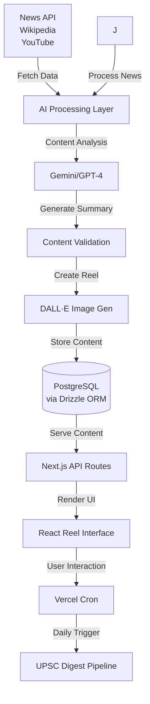
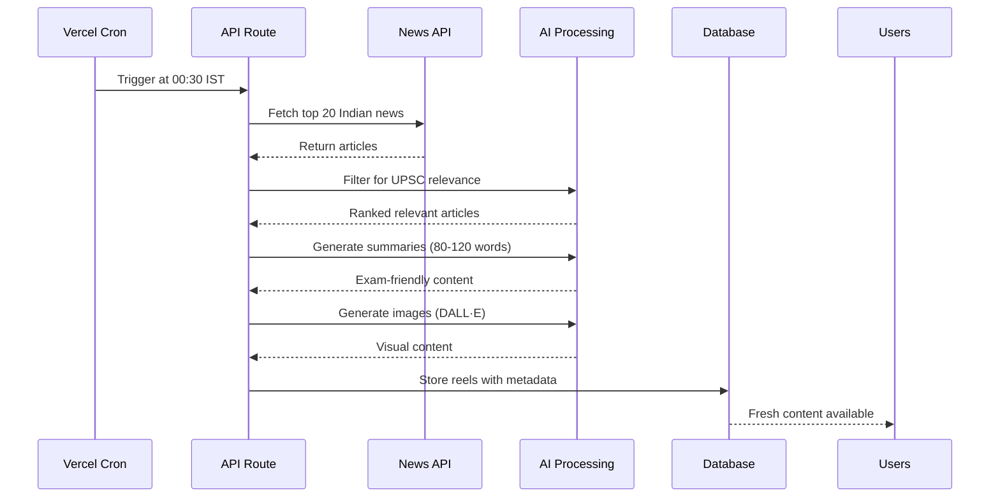

# 📚 Etrant

<div align="center">
  


**Scroll. Learn. Test. Repeat.**

_An Instagram-like knowledge platform for students, aspirants, and curious minds_

[](https://nextjs.org/)
[](https://reactjs.org/)
[](https://www.typescriptlang.org/)
[](https://www.postgresql.org/)

[🚀 Live Demo](https://wiki.akkhil.dev) • [🐛 Report Bug](https://github.com/akhil683/wiki-reel/issues) • [💡 Request Feature](https://github.com/akhil683/wiki-reel/issues)

</div>

---

## 🎯 What is Etrant?

Etrant transforms the way students learn by combining the addictive swipe experience of Instagram with educational content. Get bite-sized Wikipedia summaries, exam-focused quizzes, and daily current affairs delivered through an intuitive reel-based interface.

### ✨ Why Etrant?

- **📱 Mobile-First Learning**: Learn on-the-go with a familiar social media interface
- **🎯 Exam-Focused**: Tailored content for JEE, NEET, UPSC, and other competitive exams
- **🤖 AI-Powered**: Smart content curation and personalized learning paths
- **📊 Progress Tracking**: Visual knowledge maps and gamified learning experience
- **📰 Stay Updated**: Daily UPSC-friendly current affairs digest

---

## 🌟 Key Features

### 📖 **Knowledge Reels**

Swipe through AI-curated Etrant summaries designed for quick comprehension and retention.

### 🧠 **Smart Quiz Engine**

- Select your target exam (JEE, NEET, UPSC, CAT, etc.)
- Get personalized MCQ reels based on your syllabus
- Track performance with detailed analytics

### 📰 **Daily Current Affairs**

- Automated pipeline delivers fresh content daily at midnight IST
- Top 20 Indian news articles filtered for UPSC relevance
- AI-generated visuals for enhanced engagement

### 🏆 **Gamification System**

- XP points and daily streaks
- Competitive leaderboards
- Achievement badges for topic mastery
- Social learning features

### 📚 **Multi-Source Content**

- Wikipedia article summaries
- Research paper insights
- Educational YouTube transcript analysis
- Curated blog content

---

## 🛠️ Technology Stack

<table>
<tr>
<td valign="top" width="33%">

**Frontend**

- Next.js 15 (App Router)
- React 19
- TypeScript
- TailwindCSS
- Posthog
- Zustand

</td>
<td valign="top" width="33%">

**Backend**

- Next.js Server Actions
- Vercel Cron Jobs
- Drizzle ORM
- PostgreSQL (Neon)
- NextAuth.js

</td>
<td valign="top" width="33%">

**AI & APIs**

- Google Gemini

</td>
</tr>
</table>

---

## 🏗️ System Architecture



---

## 🚀 Quick Start

### Prerequisites

- Node.js 18+
- pnpm (recommended) or npm
- PostgreSQL database (or Neon account)

### Installation

1. **Clone and Install**

   ```bash
   git clone https://github.com/akhil683/wiki-reel.git
   cd wiki-reel
   pnpm install
   ```

2. **Environment Setup**

   ```bash
   cp .env.example .env.local
   ```

   Fill in your environment variables:

   ```env
   # Database
   DATABASE_URL="your_postgresql_connection_string"

   # Authentication
   NEXTAUTH_SECRET="your_nextauth_secret"
   NEXTAUTH_URL="http://localhost:3000"
   GOOGLE_CLIENT_ID="your_google_client_id"
   GOOGLE_CLIENT_SECRET="your_google_client_secret"

   # AI Services
   GEMINI_API_KEY="your_gemini_api_key"

   #Email Variables
   SMTP_HOST="smto_host"
   SMTP_PORT="port"
   SMTP_USER="Your_email"
   SMTP_PASS="smtp_password"

   #Analytics
   NEXT_PUBLIC_POSTHOG_KEY="your_posthog_key"
   NEXT_PUBLIC_POSTHOG_HOST="posthog_host"

   ```

3. **Database Setup**

   ```bash
   pnpm drizzle-kit generate
   pnpm drizzle-kit push
   ```

4. **Start Development Server**
   ```bash
   pnpm dev
   ```

Visit `http://localhost:3000` to see Etrant in action! 🎉

---

## 📅 Daily UPSC Digest Pipeline

Our automated content pipeline ensures fresh, relevant content daily:



**Cron Configuration** (`vercel.json`):

```json
{
  "crons": [
    {
      "path": "/api/cron/daily-digest",
      "schedule": "30 18 * * *"
    }
  ]
}
```

---

## 📊 Project Structure

```
wiki-reel/
├── 📁 app/                   # Next.js App Router
│   ├── 📁 auth/              # Authentication pages
│   ├── 📁 api/               # API routes & cron jobs
│   └── 📁 (protected)/       # Main reel interface
├── 📁 components/            # Reusable UI components
│   ├── 📁 ui/                # Shadcn UI components
│   ├── 📁 reels/             # Reel-specific components
│   └── 📁 maps/              # Knowledge map components
├── 📁 lib/                   # Utilities & configurations
│   ├── 📁 db/                # Database schema & queries
│   ├── 📁 prompts/           # AI service integrations prompts
│   └── 📁 email/             # send email functions
├── 📁 public/                # Static assets
└── 📁 types/                 # TypeScript definitions
```

---

## 🎯 Roadmap

### 🚧 In Progress

- [ ] **AI Flashcards**: Spaced repetition system for better retention
- [ ] **Study Circles**: Peer learning groups based on exam categories
- [ ] **Advanced Analytics**: Detailed performance insights and recommendations

### 🔮 Future Features

- [ ] **Video Summaries**: AI-generated short explainer videos
- [ ] **Audio Mode**: Podcast-style learning for commuters
- [ ] **AI Mentor**: Interactive Q&A for deeper understanding
- [ ] **Offline Mode**: Download reels for offline access
- [ ] **Micro-Certifications**: Shareable achievement certificates
- [ ] **Multi-language Support**: Content in regional languages

### 🌟 Long-term Vision

- [ ] **AR Knowledge Maps**: Immersive 3D topic visualization
- [ ] **Collaborative Notes**: Community-driven content creation
- [ ] **Live Study Sessions**: Real-time group learning experiences

---

## 🤝 Contributing

We welcome contributions from the community! Here's how you can help:

### 🐛 **Found a Bug?**

1. Check [existing issues](https://github.com/akhil683/wiki-reel/issues)
2. Create a detailed bug report with steps to reproduce

### 💡 **Have a Feature Idea?**

1. Open a [feature request](https://github.com/akhil683/wiki-reel/issues/new?template=feature_request.md)
2. Describe the problem it solves and potential implementation

### 🔧 **Ready to Code?**

1. Fork the repository
2. Create a feature branch: `git checkout -b feature/amazing-feature`
3. Make your changes and add tests
4. Commit with conventional commits: `git commit -m 'feat: add amazing feature'`
5. Push to your branch: `git push origin feature/amazing-feature`
6. Open a Pull Request

### 📝 **Areas We Need Help With**

- 🎨 UI/UX improvements
- 🤖 AI prompt optimization
- 📊 New exam category content
- 🌐 Internationalization
- 📱 Mobile app development
- 🔍 SEO optimization

---

## 🙏 Acknowledgments

- 📚 **Wikipedia** - For making knowledge freely available
- 🤖 **OpenAI** - For powerful AI capabilities
- 🎨 **Unsplash** - For beautiful stock imagery
- 🌟 **Open Source Community** - For inspiration and tools

---

<div align="center">

[⭐ Star this repo](https://github.com/akhil683/wiki-reel) • [🍴 Fork it](https://github.com/akhil683/wiki-reel/fork) • [📢 Share it](https://twitter.com/intent/tweet?text=Check%20out%20WikiReel%20-%20Instagram-like%20learning%20platform!&url=https://github.com/akhil683/wiki-reel)

</div>
